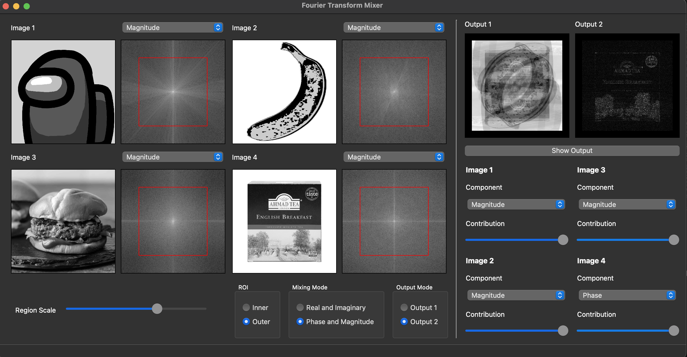

# Fourier Transform Mixer
## Introduction

This desktop program is designed to illustrate the significance of magnitude and phase components in a signal, particularly emphasizing the frequencies' contributions. The application operates on 2D signals, represented by grayscale images, while the underlying concept applies universally to any signal. The software includes various features aimed at providing a comprehensive understanding of Fourier Transform components.



## Features

### Images Viewers

- **Open and View Images:** The program allows users to open and view four grayscale images simultaneously, ensuring uniformity in size.
- **Color Conversion:** If a user opens a colored image, the program automatically converts it to grayscale.
- **FT Components Display:** Each image has two displays: one for the image and the other for Fourier Transform components (Magnitude, Phase, Real, Imaginary). Users can switch between components via a combo-box/drop-menu.
- **Easy Browse:** Users can change images by double-clicking on the respective viewer, enabling a convenient browsing function.

### Output Ports

- **Two Output Viewports:** The mixer's result is displayed in one of two output viewports, with each viewport mirroring the input image viewport.
- **User Control:** Users can specify in which viewport the mixer result will be displayed.

### Brightness/Contrast

- **Adjustment Options:** Users can change the brightness/contrast of any image viewport through mouse(Hold right click and move) dragging, applicable to all four components.

### Components Mixer

- **Weighted Average:** The output image is the inverse Fourier transform (ifft) of a weighted average of the Fourier Transform components of the input images.
- **Customizable Weights:** Users can customize the weights of each image's Fourier Transform components using intuitive sliders.

### Regions Mixer

- **Selectable Regions:** Users can choose regions for each Fourier Transform component, specifying inner (low frequencies) or outer (high frequencies) regions.
- **Visual Indication:** A rectangle drawn on each Fourier Transform, with customizable size/percentage via a slider or resize handles, visually represents the selected region. The selection is consistent across all four images.

### Code Practices

- **Object-Oriented Programming (OOP):** The code is organized using OOP concepts to encapsulate functionalities within image and display classes, reducing redundancy and enhancing maintainability.
- **Logging:** Logging is implemented to track user interactions and critical steps, aiding in debugging and problem resolution. The Python logging library is utilized to log essential information into a text file, demonstrating its role in problem resolution.

## Getting Started

To use the Fourier Transform Mixer, follow these steps:

1. Clone the repository.
2. Run the following command

```
pip install -r requirements.txt
```

3. Run main.py

4. Load four grayscale images.
5. Adjust Fourier Transform components, weights, and regions as desired.
6. Monitor the mixing progress with the weighted sliders.
7. View the resulting mixed image in the specified output viewport.

## Logging

The program logs user interactions and critical steps, aiding in debugging and problem resolution. Log files are generated to provide insights into the development process.
